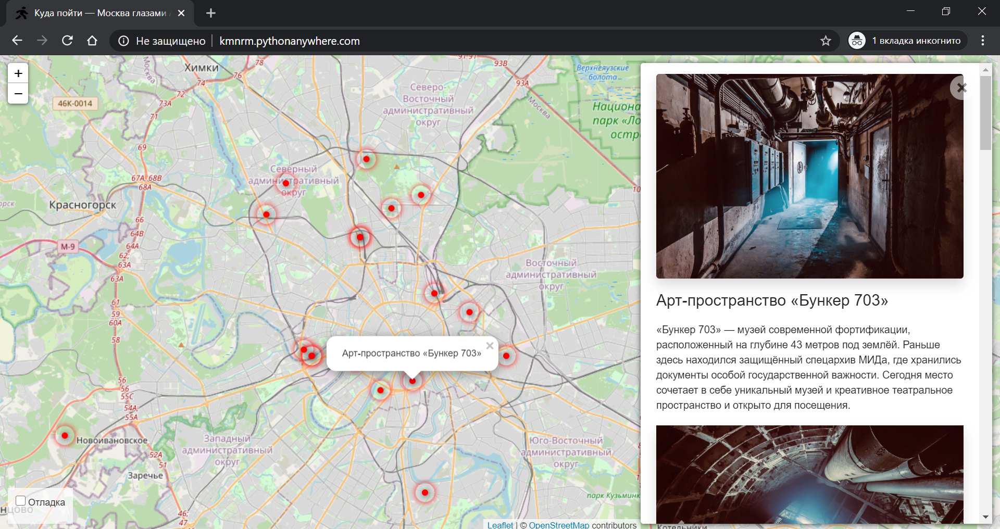
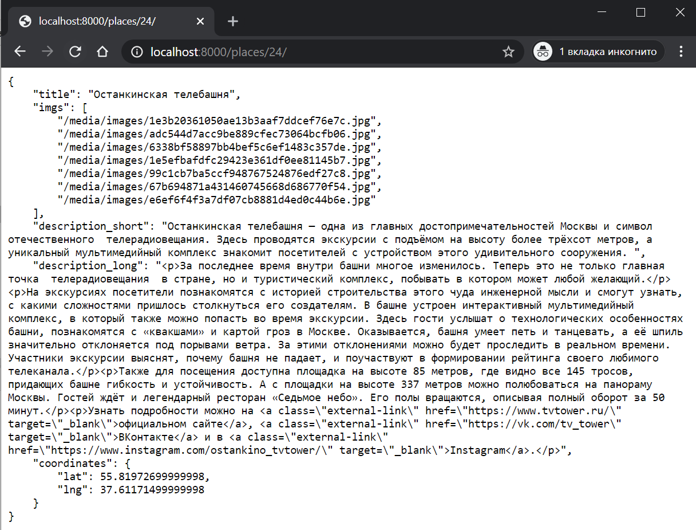
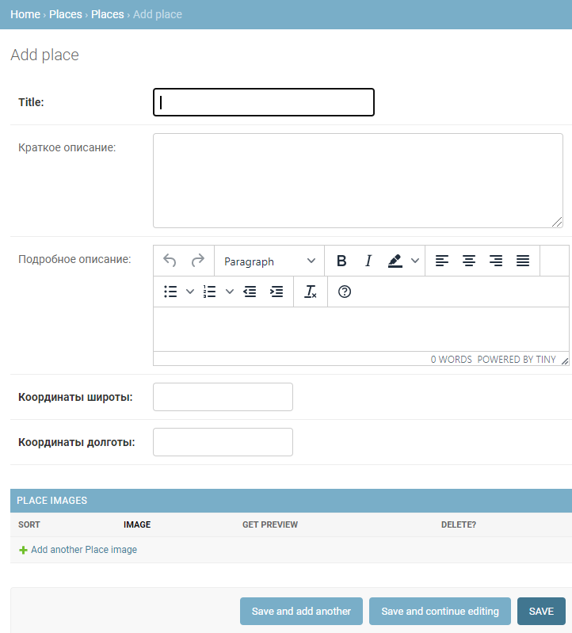
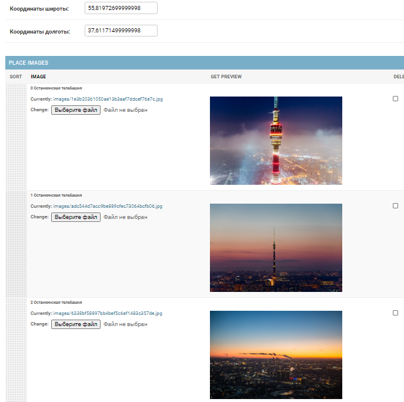
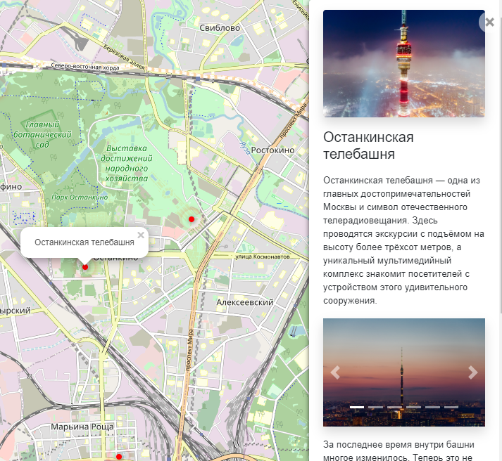

# Куда пойти — Москва глазами Артёма

Сайт о самых интересных местах в Москве. Авторский проект Артёма.



[Рабочая версия сайта](http://kmnrm.pythonanywhere.com/).

## Как запустить

- Скачайте код
- В каталоге с проектом создайте файл `.env`, добавьте  `SECRET_KEY` и установите включите режим отладки:
    ```
    SECRET_KEY=your_secret_key
    DEBUG=True
    ```
- Установите зависимости командой `pip install -r requirements.txt`
- Откройте файл `settings.py` в каталоге `afisha` и добавьте `localhost` в `ALLOWED_HOSTS`:
    ```
    ALLOWED_HOSTS = ['localhost']
    ```
- Запустите сервер командой `python3 manage.py runserver`
- Откройте в браузере [http://localhost:8000](http://localhost:8000/)

При удачном запуске в терминале Вы увидете следующее:
```sh
$ python manage.py runserver
Watching for file changes with StatReloader
Performing system checks...

System check identified no issues (0 silenced).
June 01, 2001 - 18:29:15
Django version 3.0.7, using settings 'afisha.settings'
Starting development server at http://127.0.0.1:8000/
Quit the server with CTRL-BREAK.
[01/Jun/2001 18:29:25] "GET / HTTP/1.1" 200 15389

```

## Настройки

Внизу справа на странице можно включить отладочный режим логгирования.


Настройки сохраняются в Local Storage браузера и не пропадают после обновления страницы. Чтобы сбросить настройки удалите ключи из Local Storage с помощью Chrome Dev Tools —> Вкладка Application —> Local Storage.

Если что-то работает не так, как ожидалось, то начните с включения отладочного режима логгирования.

## API

JSON данные о заведении можно получить по адресу
` http://localhost:800/places/{place_id}/ `, где `{place_id}` - это соответсвующий значению в БД `id` заведения.

Так выглядят [данные об Останкинской телебашне](http://localhost:8000/places/24/) с `id=24`:


### Загрузка данных
Ссылки на данные для сайта можно найти в [этом репозитории](https://github.com/devmanorg/where-to-go-places).

Для загрузки данных о заведениях города на сайт используется команда:

```sh
$ python manage.py load_place https://github.com/devmanorg/where-to-go-places
```
При успешной загрузке данных после запуска команды в терминале появится сообщение:
```sh
Successfully added places from https://github.com/devmanorg/where-to-go-places
```

Загрузить свои данные можно также из панели администратора. Для этого:
 - создайте профиль администратора командой `python manage.py createsuperuser`
  - введите данные для логина при входе в [админку](http://localhost:8000/admin).
  - в разделе Places выберите `+ADD PLACE`

    

При добавлении изображений следует учитывать, что первое изображение в списке будет заглавным для заведения на сайте. Остальные окажутся в галерее:





Порядок можно менять непосредственно в админке с помощью drag-n-drop.

## Используемые библиотеки
Сайт создан с помощью фреймворка [Django](https://www.djangoproject.com/).

Для фронтенда были использованы следующие библиотеки:
- [Leaflet](https://leafletjs.com/) — отрисовка карты
- [loglevel](https://www.npmjs.com/package/loglevel) для логгирования
- [Bootstrap](https://getbootstrap.com/) — CSS библиотека
- [Vue.js](https://ru.vuejs.org/) — реактивные шаблоны на фронтенде


## Цели проекта

Код написан в учебных целях — это урок в курсе по Python и веб-разработке на сайте [Devman](https://dvmn.org).

Тестовые данные взяты с сайта [KudaGo](https://kudago.com).
